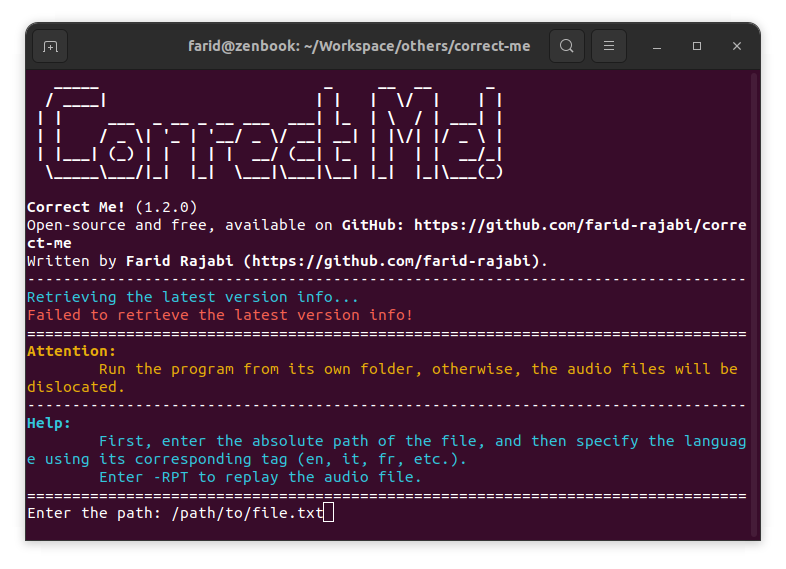

# CORRECT ME!

[](https://www.gnu.org/licenses/gpl-3.0)

This app is created to assist language learners with their writing issues, especially the spelling of words. It supports all the languages supported by Google Translate.

**Supported OS: Linux, Windows**

## Screenshots




## Installation

The program itself does not require any installation.

### Requirements

To run it, [Python](https://www.python.org) should be installed on the system. (The latest stable version is preferable.)

The following Python packages are required:

- [gTTS](https://pypi.org/project/gTTS)
- [playsound](https://pypi.org/project/playsound)

Use the following commands to install the packages:

```
pip install gTTS
pip install playsound
```

If you are using a Linux distribution with Python3 on it, you might try `pip3` instead of `pip`.

## How to Use

1. Create a text file (the extension is optional) and write the words/phrases you want to practice their spelling.
2. Run the program.
    - If you are on Linux, run `CorrectMe.sh`.
    - If you are on Windows, run `CorrectMe.bat`. \
    THE PROGRAM REQUIRES INTERNET CONNECTION, UNLESS YOU HAVE GONE THROUGH THE FILE SPECIFIED IN STEP 1 AT LEAST ONCE AND HAVE NOT CHANGED IT.
3. Read the Attention and Help section before proceeding.
4. Specify the text file by its location and the language.
5. Write what you hear and then press Enter.
